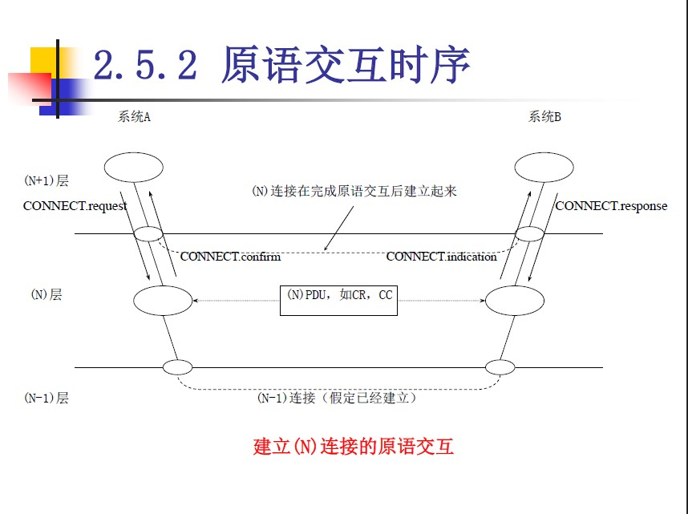

# 第二章 协议分层的基本原理
- 分层：
    - 把一个完整的问题分成许多较小的问题解决
    - 保证各层之间独立
- 服务与服务访问点
    - N层实体实现的服务为N+1层所使用
    - N层可利用第N-1层服务来提供它自己的服务
    - 服务访问点（SAP）：N层的SAP是N+1层可以访问N层的地方
    - 实体通过SAP传递服务的原则：
        1. 一个（N）SAP只能被一个N实体所使用，并且只能被一个N+1实体所使用
        1. 一个N实体可以使用多个（N）SAP，并且一个N+1实体也可以使用多个（N）SAP

- 服务分类
    - 面向连接的服务：建立连接，顺序传输
    - 无连接服务：不能防止报文的丢失或失序，不可靠服务
- 连接复用与分用
    - 复用的目的：提高使用效率，节省费用；在只有一条N-1连接时，提供多条N连接
    - 分用的目的：在有多条N-1连接可用时，提高可靠性；提高吞吐量和其他服务质量；利用廉价的多条N-1连接提高经济效益
- 服务原语
    - 请求
    - 指示
    - 响应
    - 证实
