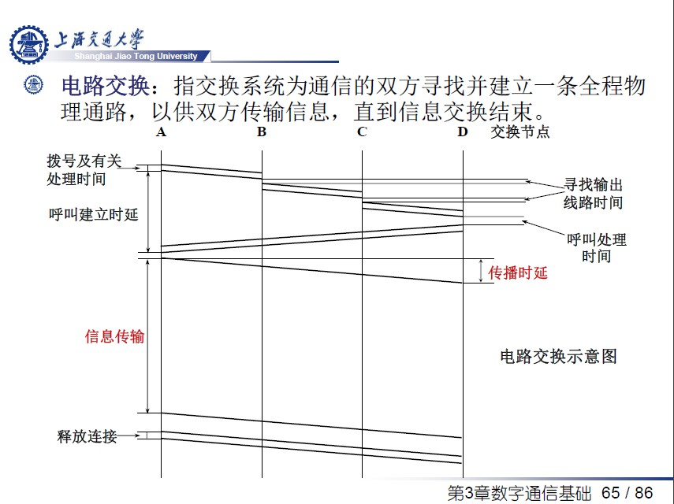
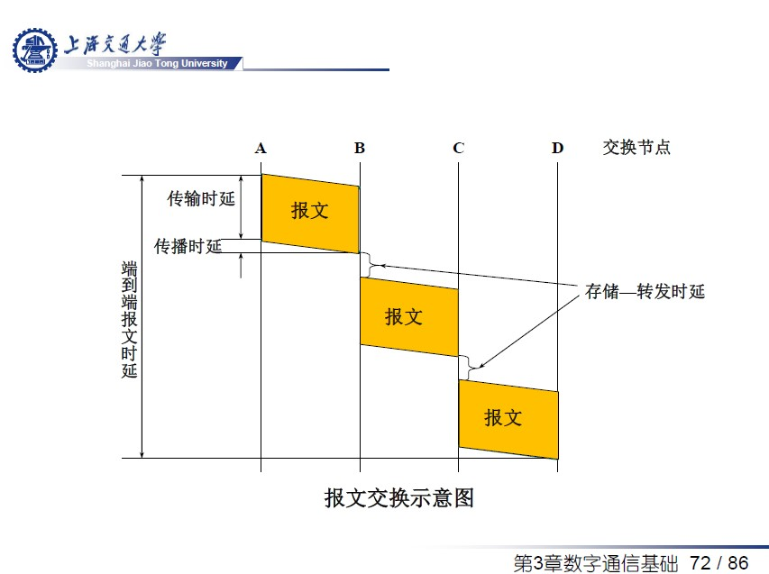
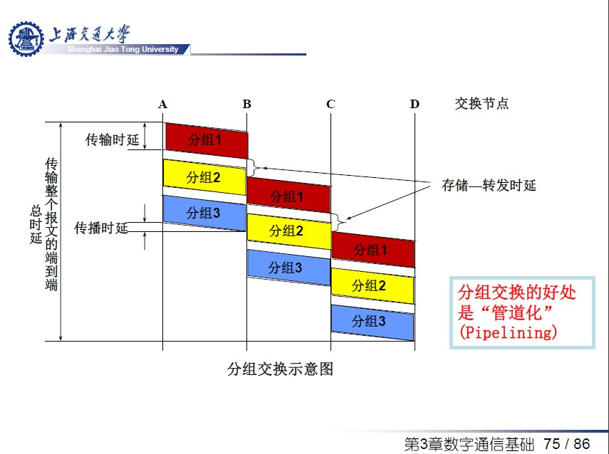
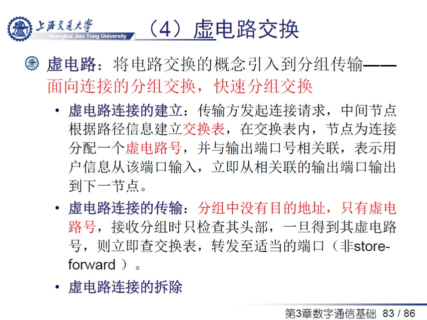
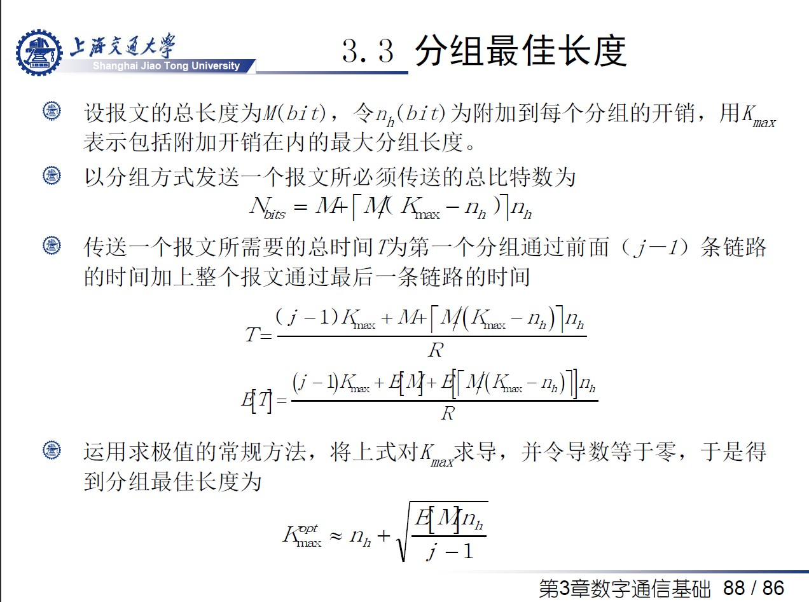

# 第三章 现代通信网及其交换技术
- 波特率：每秒钟信号变化的次数（Hz）
- 比特率：每秒钟传输数据的位数（bps）
- 全双工通信：通信双方可以同时发送和接收信息--全双工需要两条信道
- Nyquist定理：在假定的理想条件（无噪声）下，为避免码间串扰，当带宽为W Hz时，码元的传输速率的上限值=2W Baud
- 香农定理：带宽受限且有高斯白噪声干扰的信道的极限、无差错的信息传输速率。在噪声信道中，当带宽为W Hz，信噪比为S/N，则最大数据传输速率(b/s)=Wlog(1+SN)
- 数字数据的模拟信号调制
    - 调幅
    - 调频
    - 调相
    - 正交调相
- 数字数据的数字信号编码
    - 不归零编码：编码密度最高，不能携带时钟
    - 曼彻斯特编码：编码密度最低，波特率是比特率两倍，携带了时钟
    - 差分曼彻斯特编码
    - 4B/5B编码：编码密度略低于不归零编码，高于曼彻斯特编码
- 模拟数据的数字信号编码
- 模拟数据的模拟信号调制
- 信道复用
    - 频分复用（FDM）：每个用户分配固定的频带
    - 时分复用（TDM）：将时间划分为一段段等长的时分复用帧，每个时分复用的用户在每一个TDM帧中占用固定序号的时隙
    - 统计时分复用
    - 波分复用
    - 码分复用CDMA：用户在相同时间使用相同的频带， 使用不同的码型；抗干扰能力强
    - 正交频分复用OFDM
- 数据交换
    - 电路交换
    
        - 优点:数据传输时延小，对用户透明，吞吐量高
        - 缺点：必须有一个呼叫建立的过程（时延较大）；信道带宽利用率低；存在呼叫损失现象；难以实施差错控制等
        - 不适合具有突发性的计算机数据传输
    - 报文交换：存储-转发机制；线路利用率比较高；每个中间站点都必须要有足够大的缓存；
        - 报文交换不适合于实时性比较高的业务
        - 端到端时延
            - 传输时延
            - 传播时延
            - 存储-转发时延
                - 排队等待时间
                - 存入中间节点的处理时间
                - 从存储器送到输出链路的处理时间
    
    - 分组交换：将报文分成若干个定长的分组；可能延时较大，且不可估计；接受分组和发送分组的顺序可能不一致，可能需要重组
    
        - 分组交换两种交换机制
            - 数据报（无连接方式）
            - 虚电路（面向连接方式）
    
- 最佳分组长度
