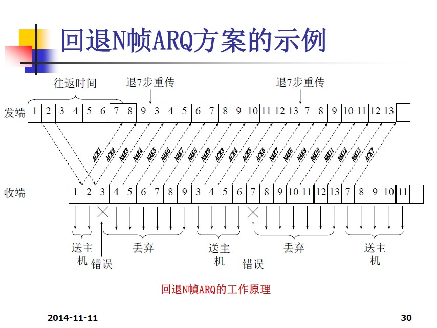

# 第四章 数据链路层
- 数据链路层的主要功能是在物理层提供的通信线路连接和比特流传输功能的基础上，在相邻的两台计算机之间在链路层上提供可靠和有效的通信
- 为网络层提供三种合理的服务
    - 无应答式无连接服务
    - 应答式无连接服务
    - 面向连接的服务
- 帧的构成
    - 字符计数
    - 字符填充
    - 位填充
- 差错控制
    1. 反馈确认
    1. 超时机制
    1. 顺序编号
- 差错检测和纠正
    1. 前向纠错（FEC）
    1. 自动重发请求（ARQ）
    1. 纠检混合的差错控制方式
- 汉明距离：在一个码组集合中，任意两个码字之间对应位上码元取值不同的位的数目定义为这两个码字之间的汉明距离。d(x,y) = $\sum x[i]\ xor\ y[i]$
    - 在一个码字集合中，任意两个码元之间汉明距离的最小值称为这个编码的最小汉明距离
    - 汉明距离越大，码组越具备抗干扰能力
    - 当码组用于检测错误时，设可检测e个位的错误，则 $d \ge e+1$
    - 若码组用于纠错，设可纠错t个位的错误，则 $d \ge 2t+1$
    - 如果码组用于纠正t个错，同时检测e个错，则 $d \ge 2t+e+1$
- 奇偶校验码
    - 奇校验，偶校验
    - 二维奇偶校验
- 循环冗余码（CRC）
- 三种ARQ方案：
    - 肯定确认（ACK）
    - 否定确认（NAK）
    - 超时重发
1. 等待式ARQ

1. 回退N帧ARQ

1. 选择性重发ARQ

- 滑动窗口式流量控制
    - 主要思想：允许连续发送多个帧而无需逐个地等待应答，每个要发送的帧都包含一个序号（n位）。在传输过程中，循环重复使用已收到确认的那些帧的序号
    - 在发送端和接收端分别设置发送窗口和接收窗口

    - 当接收窗口保持不动时，发送窗口无论如何也不会前进，只有接收窗口前进后，发送窗口才有了前进的可能
    - 为了减少开销，接收端不一定每收到一个正确的数据帧就必须返回一个确认帧，而是可以在连续收到几个正确的数据帧以后，才对最后一个数据帧发回确认帧
